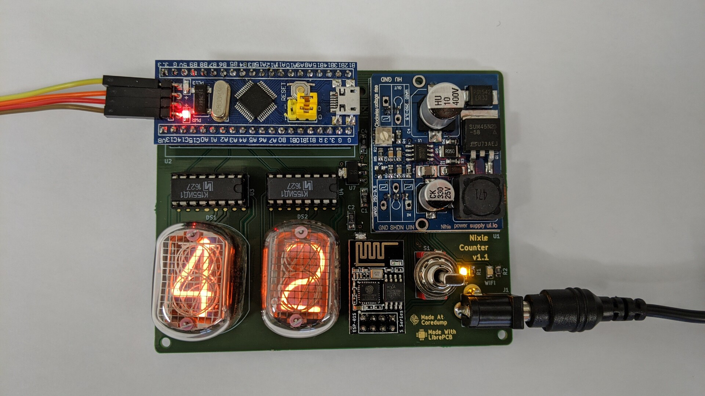
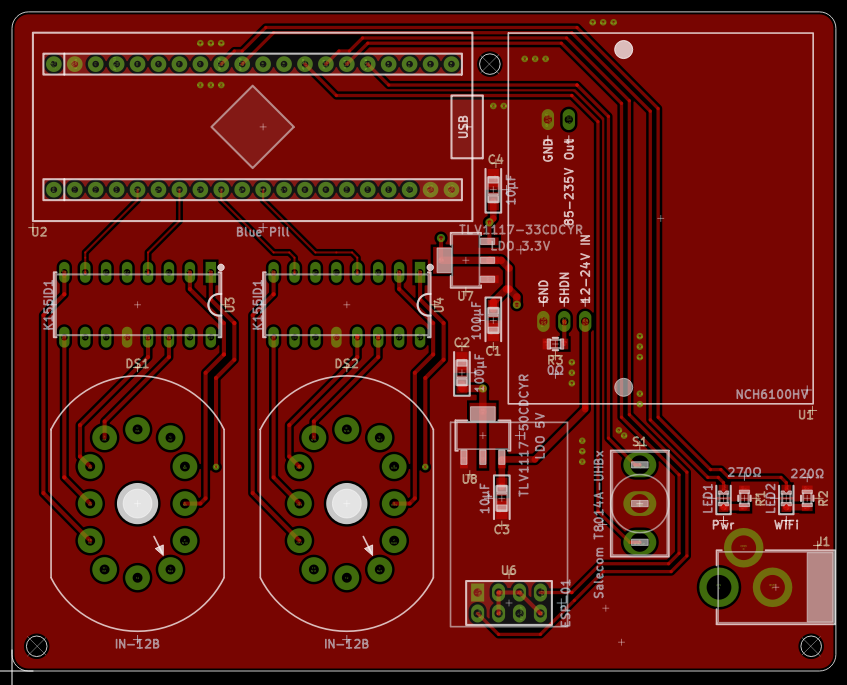
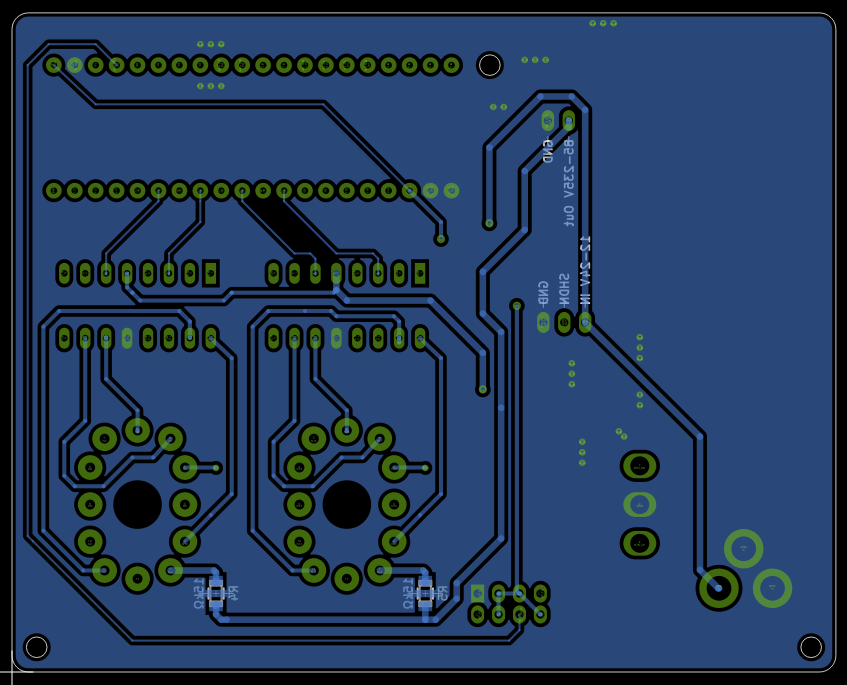

# Nixie Counter

## Description / Overview

PCB for a physical "people now present" counter that sends it data directly to
the [SpaceAPI](https://spaceapi.io/).

**Microcontroller**

The microcontroller is a STM32F103 based "Blue Pill" board. We chose this
because it's very cheap, very widely available and it can run firmware written
in [Rust](https://www.rust-lang.org/).

**WiFi**

Data is sent via WiFi using an ESP-01 module. The module is controlled by the
Blue Pill through AT commands over a serial connection.

**Input Methods**

To enter the number of people present, a 2-position momentary toggle switch is
used that can be pushed upwards or downwards.

**Display**

The number of people present is then displayed on two IN-12B nixie tubes. Those
tubes need 150-160 V for turning on, for this we use a [NCH6100HV
module](https://www.nixie.ai/nch6100hv/). The tubes are controlled through two
K155ID1 BCD-to-Decimal drivers. Those need 5V logic levels, so we use a level
shifter between the drivers and the microcontroller.

**Power Supply**

Input power is supplied at 12V. The nixie power supply converts that to ~150V.

Two LDOs convert the 12V to 5V (for the nixie drivers) and 3.3V (for the rest).

**Status LEDs**

There's a yellow LED to indicate that the controller has power and runs the
correct firmware, and a green LED to indicate whether the ESP-01 module is
connected to the WiFi or not.

## PCB

## Editing

This is a [LibrePCB](https://librepcb.org) project!

## License

TAPR Open Hardware License, see [LICENSE.txt](LICENSE.txt).
